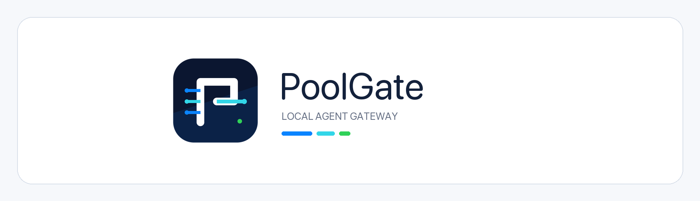

<p align="center">
  
</p>

# PoolGate — Local Agent Gateway

统一管理大模型账号池，单端口 (9800) 根据请求路径自动识别协议，对外提供 OpenAI / Anthropic 兼容 API，附带完整的请求日志与用量统计。

品牌标识中的三条输入路径代表多协议与多来源模型资源，P 形门体代表本地控制边界，单一青色出口代表 PoolGate 对 Agent 暴露的统一端点。源文件位于 [`src/assets/brand`](src/assets/brand)。

## 核心特性

### 🔌 多协议智能路由
- **自动协议识别**：根据请求路径自动检测 OpenAI、Anthropic、Gemini 等协议
- **统一代理端点**：单端口 9800 对外暴露，客户端无需关心后端协议差异
- **智能负载均衡**：基于账号健康状态、配额余量、响应时间的智能路由
- **实时路由拓扑**：可视化展示 Gateway → Protocol → Pool → Provider 四层路由关系

### 🏦 多来源账号池
- **统一凭证管理**：支持 API Key、OAuth、Token 等多种凭证类型
- **批量导入**：支持 API Key 文本、Codex auth.json、Sub2API、CPA、Cockpit、JSON、CSV 等格式
- **智能归一化**：所有来源的账号自动归一化进统一池，按模型能力组织路由池
- **健康监控**：实时监控账号状态（健康/受限/故障），自动故障转移

### 📊 可观测性
- **实时请求日志**：完整的请求/响应日志，支持按状态、模型、账号等维度筛选
- **用量统计**：Token 使用量、成本估算、请求成功率等核心指标
- **告警系统**：账号异常、配额不足、服务故障等实时告警
- **拓扑可视化**：交互式路由拓扑图，支持搜索、缩放、异常链路高亮

### 🖥️ 桌面应用体验
- **Tauri 2.0**：原生桌面应用，支持 macOS、Windows、Linux
- **系统托盘**：最小化到托盘，后台持续运行
- **macOS 风格 UI**：Source List + Toolbar + Content View 信息架构
- **深色主题**：专业运维风格，长时间使用不疲劳

## 技术栈

### 前端
- **框架**：React 18 + TypeScript
- **样式**：TailwindCSS 4
- **状态管理**：TanStack Query v5
- **图表**：Recharts
- **拓扑图**：@xyflow/react + ELK.js
- **构建工具**：Vite 6

### 后端
- **桌面框架**：Tauri 2.0
- **Web 框架**：Axum (Rust)
- **异步运行时**：Tokio
- **HTTP 客户端**：Reqwest
- **数据库**：SQLite (rusqlite)
- **日志**：Tracing

## 快速开始

### 环境要求
- Node.js 18+
- Rust 1.70+
- 系统依赖：见 [Tauri Prerequisites](https://v2.tauri.app/start/prerequisites/)

### 开发模式

```bash
# 克隆项目
git clone https://github.com/your-org/poolgate.git
cd poolgate

# 安装前端依赖
npm install

# 启动开发服务器
npm run tauri dev
```

### 构建发布版

```bash
# 构建生产版本
npm run tauri build

# 产物位置
# macOS: src-tauri/target/release/bundle/
# Windows: src-tauri/target/release/bundle/msi/
# Linux: src-tauri/target/release/bundle/deb/
```

## 项目结构

```
poolgate/
├── src/                          # React 前端
│   ├── pages/                    # 页面组件
│   │   ├── Dashboard/            # 总览仪表盘
│   │   ├── AccountPool/          # 账号池管理
│   │   ├── AgentGroups/          # Agent 分组
│   │   ├── Providers/            # 服务商配置
│   │   ├── Logs/                 # 请求日志
│   │   ├── Analytics/            # 数据分析
│   │   ├── Settings/             # 系统设置
│   │   └── Wizard/               # 导入向导
│   ├── components/               # 共享组件
│   │   ├── ui/                   # 基础 UI 组件
│   │   └── topology/             # 拓扑图组件
│   ├── hooks/                    # React Hooks
│   └── lib/                      # 工具函数
├── src-tauri/                    # Rust 后端
│   └── src/
│       ├── db/                   # 数据库层
│       │   ├── schema.rs         # 数据库 Schema
│       │   ├── accounts.rs       # 账号 CRUD
│       │   ├── providers.rs      # 服务商管理
│       │   └── logs.rs           # 日志存储
│       ├── proxy/                # 代理服务器
│       │   ├── server.rs         # Axum 服务器
│       │   ├── router.rs         # 路由逻辑
│       │   ├── protocol/         # 协议适配器
│       │   │   ├── openai.rs     # OpenAI 协议
│       │   │   ├── anthropic.rs  # Anthropic 协议
│       │   │   └── gemini.rs     # Gemini 协议
│       │   └── auth.rs           # 认证授权
│       ├── commands/             # Tauri IPC 命令
│       └── services/             # 业务服务
├── public/                       # 静态资源
└── outputs/                      # UI 设计稿
```

## 配置说明

### 环境变量

```bash
# 数据库路径（可选，默认 ~/.poolgate/data.db）
POOL_GATE_DB_PATH=/path/to/database.db

# 代理端口（可选，默认 9800）
POOL_GATE_PROXY_PORT=9800

# 日志级别（可选，默认 info）
RUST_LOG=info
```

### 客户端配置

将客户端的 API 端点指向 PoolGate：

```bash
# OpenAI 客户端
export OPENAI_API_BASE=http://localhost:9800

# Anthropic 客户端
export ANTHROPIC_API_BASE=http://localhost:9800

# cURL 测试
curl http://localhost:9800/v1/chat/completions \
  -H "Authorization: Bearer your-api-key" \
  -H "Content-Type: application/json" \
  -d '{"model": "gpt-4", "messages": [{"role": "user", "content": "Hello"}]}'
```

## 账号导入格式

### API Key 文本
```
# 每行一个，支持 name=key 格式
sk-abc123...=My OpenAI Key
sk-def456...
```

### Codex auth.json
```json
{
  "tokens": {
    "access_token": "...",
    "id_token": "..."
  },
  "agent_identity": "..."
}
```

### Sub2API
```json
{
  "accounts": [
    {
      "credentials": {
        "api_key": "..."
      }
    }
  ]
}
```

### 通用 JSON/CSV
支持扁平 token JSON 和标准 CSV 格式，详见应用内导入向导。

## 开发指南

### 代码规范

- **前端**：ESLint + Prettier，遵循 React 最佳实践
- **后端**：`cargo fmt` + `cargo clippy`，遵循 Rust 惯用法
- **提交**：Conventional Commits 格式

### 测试

```bash
# 前端测试
npm test

# 后端测试
cd src-tauri && cargo test

# 类型检查
npm run build
```

### 拓扑图开发

拓扑图组件位于 `src/components/topology/`，使用 @xyflow/react + ELK.js 实现自动布局。

```bash
# 预览拓扑图
npx vite --port 5199
# 访问 http://localhost:5199/preview.html
```

## 架构设计

```
┌─────────────────────────────────────────────────────────────┐
│                      PoolGate Desktop                       │
├─────────────────────────────────────────────────────────────┤
│  React UI (Tauri WebView)                                   │
│  ┌─────────┬─────────┬─────────┬─────────┬─────────────┐   │
│  │Dashboard│Account  │ Agent   │  Logs   │  Topology   │   │
│  │         │ Pool    │ Groups  │         │  View       │   │
│  └─────────┴─────────┴─────────┴─────────┴─────────────┘   │
├─────────────────────────────────────────────────────────────┤
│  Tauri IPC Bridge                                           │
├─────────────────────────────────────────────────────────────┤
│  Rust Backend                                               │
│  ┌─────────────────────────────────────────────────────┐   │
│  │  Axum Proxy Server (:9800)                          │   │
│  │  ┌──────────┬──────────┬──────────┬──────────────┐ │   │
│  │  │ OpenAI   │Anthropic │ Gemini   │  Responses   │ │   │
│  │  │ Adapter  │ Adapter  │ Adapter  │  Adapter     │ │   │
│  │  └──────────┴──────────┴──────────┴──────────────┘ │   │
│  └─────────────────────────────────────────────────────┘   │
│  ┌─────────────────────────────────────────────────────┐   │
│  │  SQLite Database                                    │   │
│  │  accounts │ providers │ groups │ logs │ settings    │   │
│  └─────────────────────────────────────────────────────┘   │
└─────────────────────────────────────────────────────────────┘
                          ↓
┌─────────────────────────────────────────────────────────────┐
│                    Upstream Providers                       │
│  OpenAI │ Anthropic │ Google │ Azure │ 自定义 HTTP         │
└─────────────────────────────────────────────────────────────┘
```

## 常见问题

### Q: 为什么选择 Tauri 而不是 Electron？
A: Tauri 使用系统 WebView，打包体积小（~10MB vs ~150MB），内存占用低，原生性能更好。

### Q: 支持哪些模型提供商？
A: 支持所有 OpenAI/Anthropic/Gemini 兼容 API，包括 OpenAI、Anthropic、Google、Azure、国内各大模型厂商，以及通过自定义 HTTP 连接器接入的任何服务。

### Q: 账号凭证安全吗？
A: 凭证存储在本地 SQLite 数据库中，使用系统钥匙串（Keyring）管理敏感信息，不会上传到任何外部服务。

## 许可证

MIT License

## 致谢

- [Tauri](https://tauri.app/) - 构建更小、更快、更安全的桌面应用
- [Axum](https://github.com/tokio-rs/axum) - Ergonomic and modular web framework
- [React](https://react.dev/) - 用于构建用户界面的 JavaScript 库
- [TailwindCSS](https://tailwindcss.com/) - Rapidly build modern websites
